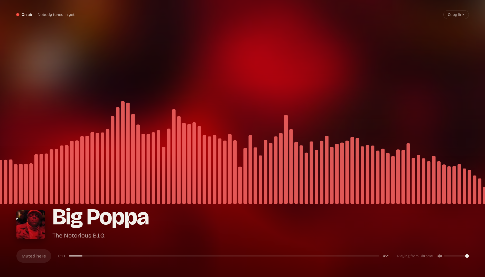
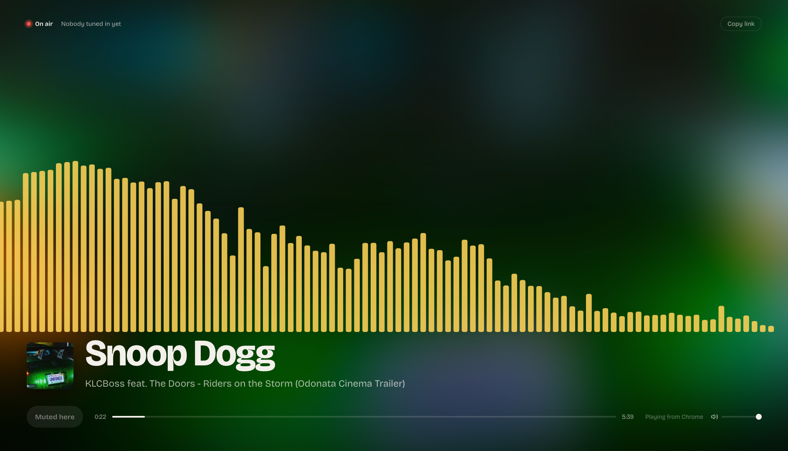

# desk-radio

Share the music playing on your Mac with your team, live. desk-radio captures your Mac's audio, streams it as MP3 over the local network, and serves a page that shows what's playing: title, artist, artwork, progress and a live spectrum. The page recolors itself to match each track.

<p align="center">
  
  
</p>
<p align="center"><sub>Each track gets its own palette, taken from its artwork.</sub></p>

- Streams only while music is playing (read from macOS Now Playing)
- Captures eqMac's enhanced output, everything the Mac plays, or any input device
- Colleagues open `http://<your-mac-ip>/` and press **Listen**

## Requirements

- macOS 14.2+ (process-tap capture), Xcode command line tools (`swiftc`)
- Node.js 22+, ffmpeg, pm2
- [media-control](https://github.com/ungive/media-control) for Now Playing info:
  `brew tap ungive/media-control && brew install media-control`

## Setup

```sh
./capture/build.sh          # builds capture/DeskRadioCapture.app
cp .env.example .env        # pick AUDIO_SOURCE (see comments in the file)
pm2 start ecosystem.config.js && pm2 save
```

On first capture, macOS asks for permission for **Desk Radio Capture**:

- `app:` and `system` sources: System Settings → Privacy & Security → Screen & System Audio Recording → *System Audio Recording Only*
- device sources (BlackHole, microphone): Privacy & Security → Microphone

Rebuilding the capture app changes its signature, so you have to grant the permission again.

## Audio sources

| `AUDIO_SOURCE` | What colleagues hear |
|---|---|
| `app:com.bitgapp.eqmac` | eqMac's enhanced output (doesn't disturb eqMac's driver) |
| `system` | Everything the Mac plays, no driver needed (don't combine with eqMac) |
| a device ID, e.g. `BlackHole2ch_UID` | That input device |

List device IDs with `capture/DeskRadioCapture.app/Contents/MacOS/DeskRadioCapture --list`.
After changing `.env`, run `pm2 restart desk-radio`.

## Notes

- The page on the streaming Mac doesn't play the stream, because it would echo and take over macOS Now Playing. It still shows the waves, which the server computes.
- Logs: `pm2 logs desk-radio`
